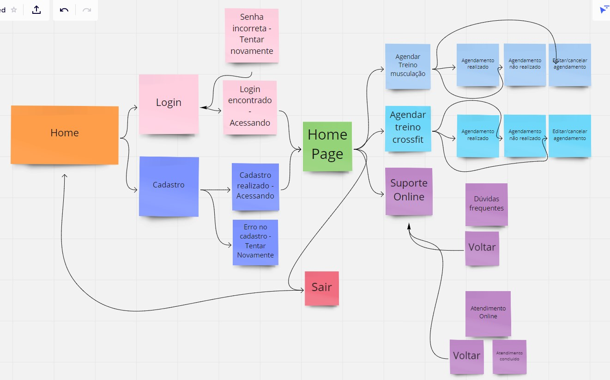
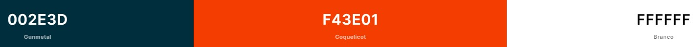
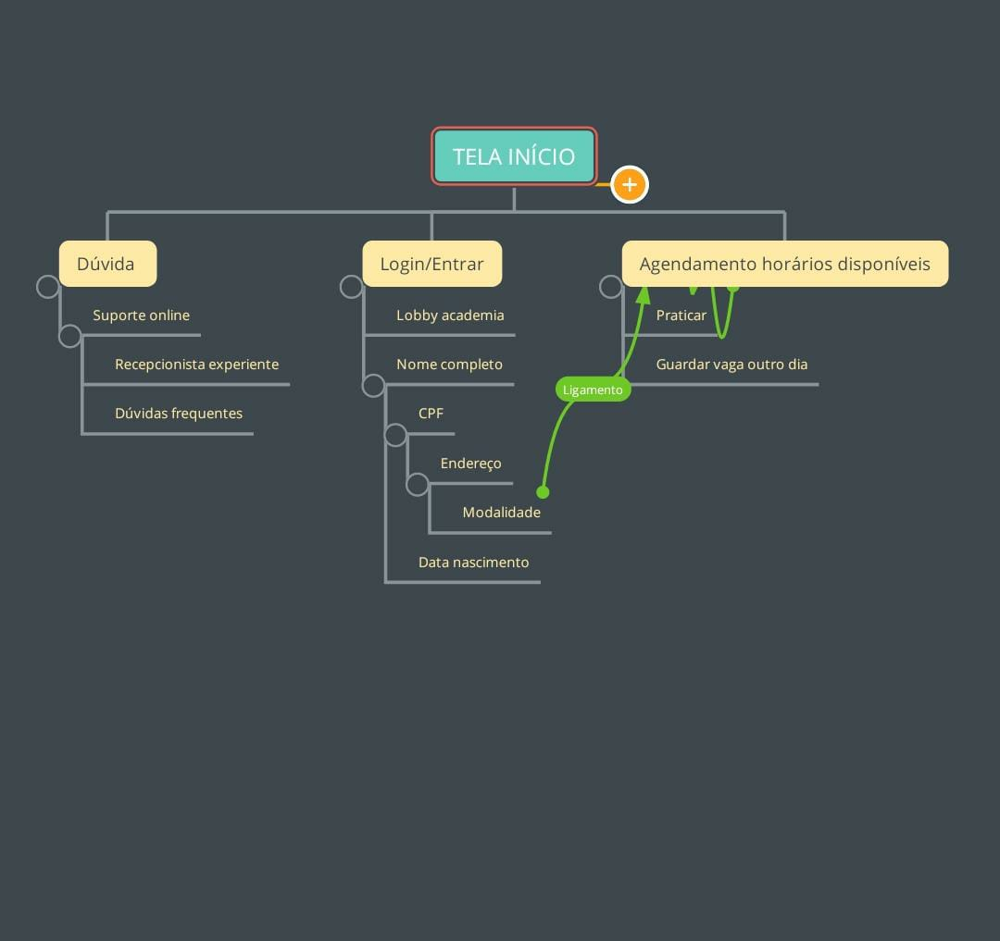
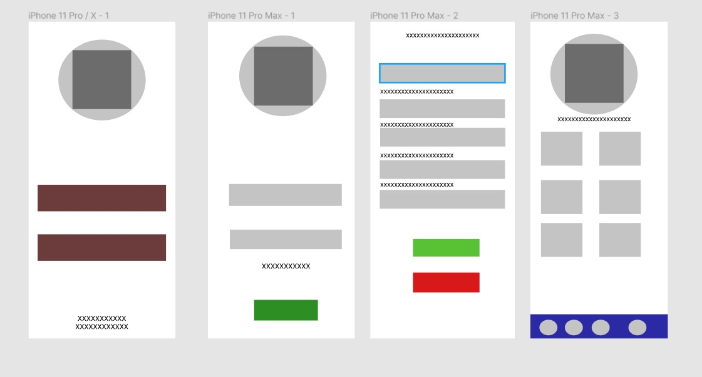

# Projeto Final - FLUTTER 
<h3>App Mobile de Academia!</h3>
> Status: Em Progresso ⚠️

 
  
  

  <h4>Fluxograma</h4>
    
  <h4>Cores</h4>
    
  <h4>AppMaps</h4>
    
  <h4>Prototipação</h4>
    

  <h4>Sobre</h4>
  
Ao longo dos anos observamos várias academias com sistemas impressões em tickets, contendo treinos, horários, anúncios, etc. 
  Para que isso tenha uma agilidade maior e mais automática, decidimos criar um aplicativo dedicado para os usuários.  Assim eles podem ver de casa os treinos, horários e aulas     personalizadas que irão acontecer. Tudo isso do sofá de casa ou até  mesmo na sua caminhada hahaha.
  

<!--SOBRE ACIMA-->
<!--PONTOS RELEVANTES ABAIXO LISTADOS ORDENADOS-->

  <h4>Pontos Positivos:</h4>
  <ol>
    <li>Acessibilidade para marcar horários e ter um controle maior do clientes</li>
    <li>Organização de treinos</li>
    <li>Ter acesso às informações da academia</li>
    <li>Suporte online</li>
  </ol>
  <!--NEGATIVOS abaxo-->
  <h4>Pontos Negativos:</h4>
  <ol>
    <li>Para ter acesso ao app, o usuário precisa terminar o cadastro na academia(presencialmente).</li>
    <li>App será somente mobile</li>
  </ol>

<!--fim ordene list-->

<!--DETALHES-->

  <h4>Descrição</h4>
  

    Utilizaremos imagens pequenas com tamanho aproximado de 300x150. Estas imagens serão utilizadas de demonstração para as técnicas de movimento dos exercicíos.
    O teste do app será aplicado no LightHouse e faremos os testes de usabilidade e funcionalidade.
  

<!--RISCO DE LINHA HR---> 

<!--TABLES USERS TRAB ABAIXO--->  

Skills Dos Participantes:

<!--Quebra de linha-->
 

Guilherme Ribas: 

  
  

<!--QUEBRA DE LINHA BR--->  
 

Jhonny Silva: 

  
  

<!--QUEBRA DE LINHA BR--->  
 

João Vitor Marques: 

  
  

<!-- titulo + detalhes + front-->

Nosso projeto é dedicado para academias que querem ter seus usuários conectados!

  <a href="https://www.youtube.com/watch?v=d6aVN7bFA2c" target="_blanck">Créditos</a>
  <a href="https://www.google.com/webhp?hl=pt-BR&sa=X&ved=0ahUKEwjv68b6usDyAhWjqpUCHaloDU0QPAgI" >Google</a>

